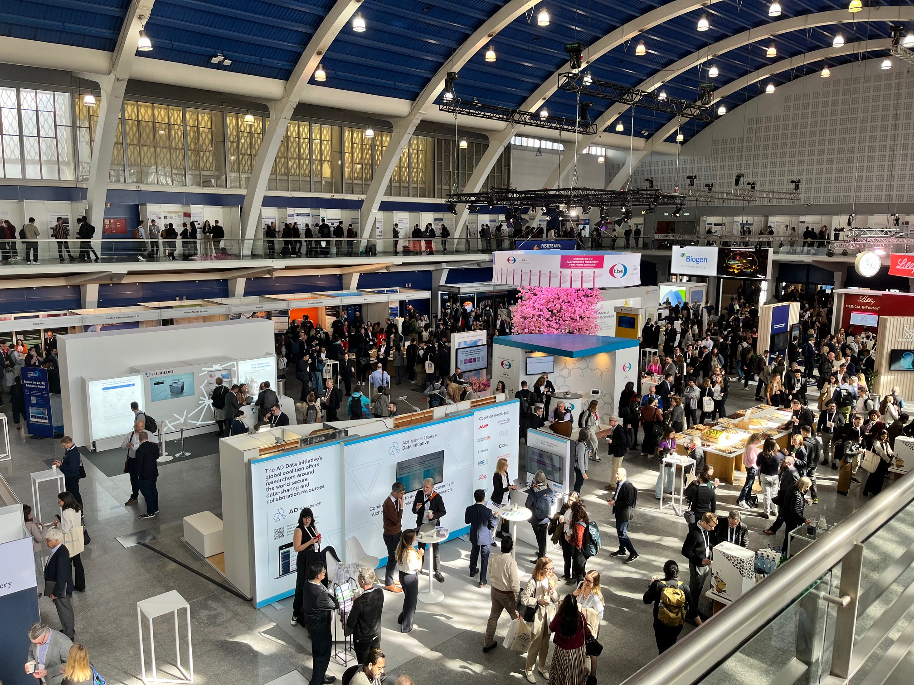
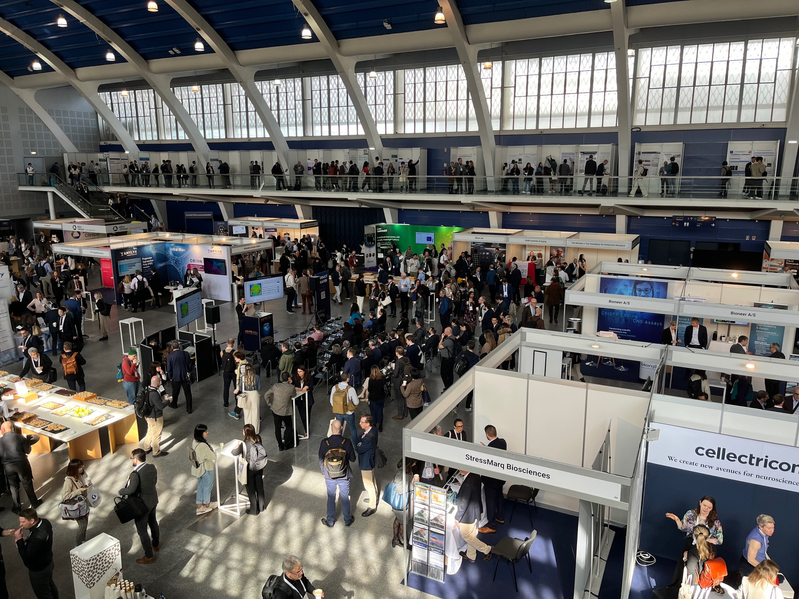
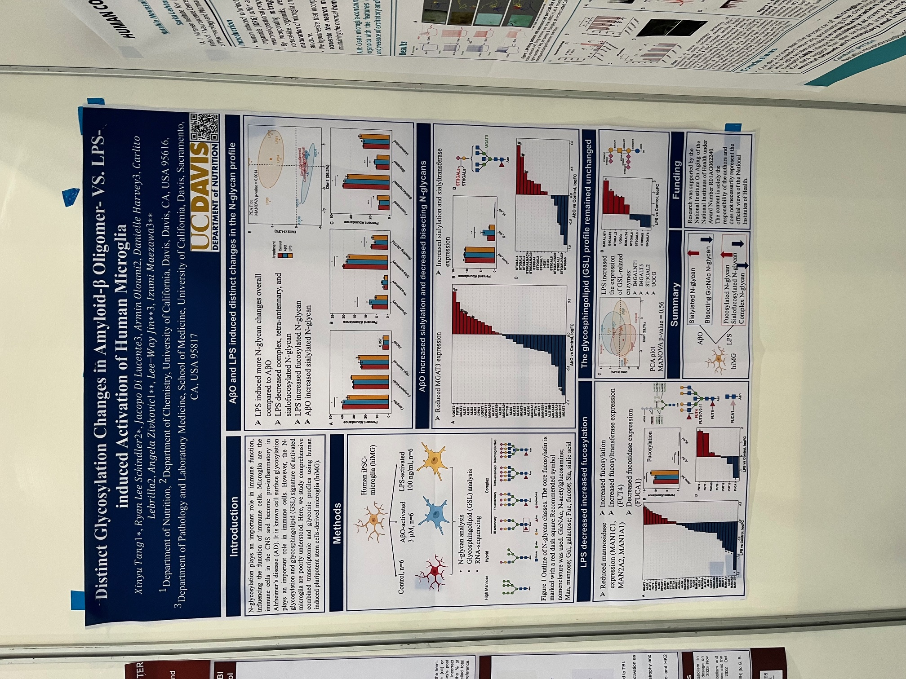

{}

## The ADPD24 conference

This is the exhibition center of the conference venue. On the first floor, there are sponsor booths with many counters and tables interspersed throughout. During breaks, the organizers provide a variety of snacks, desserts, as well as coffee, tea, mineral water, and milk. Lunchtime also offers a rich lunch packed in boxes. The bar tables provide a space for conference attendees to rest and interact. The second floor is the poster display area.

My poster.

## CityWalk in Lisbon

Lisbon sunset

Overlooking the old city of Lisbon.

Lisbon at night.

## Famous landmarks

### 1. Lisbon Cathedral/Sé de Lisboa

Exterior

Interior

### 2. Castelo de S. Jorge

Overseeing from the wall.

The Wall

Peacock in the castle.

### 3. Santa Justa Lift/Elevador de Santa Justa

### 4. Arco da Rua Augusta

### 5. 25 April Bridge/Ponte 25 de Abril & Sanctuary of Christ the King-Portugal/Santuário de Cristo Rei

### 6. Padrão dos Descobrimentos

### 7. Jerónimos Monastery/Mosteiro dos Jerónimos

A rainbow!

Interior.

### 8. Belém Tower/Torre de Belém

## Food and Dissert

### 1. Pink Street

### 2. Timeout Market

