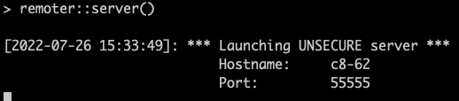

Analyzing large datasets (e.g., scRNAseq matrix) using R on a personal computer can be challenging as the personal laptop has limited resource and some steps take hours. Although we can run R on HPC, it's not optimal for interactive coding. Therefore, I'd like to share my experiences running R on HPC using [RStudio Server](https://www.rstudio.com/products/rstudio/#rstudio-server) and the [remoter R package](https://cran.r-project.org/web/packages/remoter/vignettes/remote_machines.pdf).

# Overview

- **1. RStudio Server**
- **2. Remoter**


# 1. RStudio Server

RStudio Server is the best way to control remote R session on a local computer. It has been installed on farm, and you can easily access to it following the guidance on farm. 

First, access to the computational node using

```bash
srun -p med --time=9:00:00 --cpus-per-task=32 --mem=64G --pty /bin/bash -l
```

Here, modify the number of cpus-per-task and memory based on your requirement.

In the computational node, activate your conda environment if there is any.

```bash
conda activate myenv
```

Check available modules:

```bash
module avail
```

Then, load the RStudio Server:

```bash
module load rstudio-server
```

It will return a message: 

```
To start RStudio Server with an appropriate configuration run: rserver-farm
Additional steps will be printed by that wrapper.
```

Follow the message and run
```bash
rserver-farm
```
It will return additional guidance:

```
You need to use SSH tunneling magic to port forward from your desktop to RStudio Server
ssh -L45623:c11-77:45623 username@farm.cse.ucdavis.edu
Then point your browser to http://localhost:45623
Username: username
Password: password
```

The port and password are randomly assigned. Now, open a new terminal tab. Copy and paste the SSH tunneling command above. After successfully connecting to the farm on the new terminal tab, open the browser and paste the address provided above. It will bring you to the login page. Enter the username and password provided above to start an R session on the farm!

# 2. Remoter

It's an alternative way to access remote R from a local environment.

## Setting up on HPC  
1.Install the `remoter` R package on local computer and HPC.  

```r
install.packages("remoter")
```

2.Connect to a computational node with this command:

```bash
srun -p med --time=9:00:00 --cpus-per-task=4 --mem=5G --pty /bin/bash -l
```

3.Start R on the computational node and enter `remoter::server()`. The sever will return a hostname and port. The default port is 55555.

Note: the default R version on farm is 3.6.3, you can type in the command `module load spack/R/4.1.1` before starting R. It will change the R to the latest version. Also, use `module avail` to check all available R versions.

## Port forward over ssh  

4.Open another terminal window and use this command to port forward:

```bash
ssh -t -t userid@farm.cse.ucdavis.edu -L 55556:localhost:8888 ssh c8-62 -L 8888:localhost:55555
```

Note: replace `c8-62` with the hostname that shows up on your terminal.

If the hostname on the window changes to the hostname in your command, the SSH tunnel has been successfully established.



5.Open RStudio on the local computer and run:
```r
remoter::client("localhost", port =55556)
```

You can see the console changes from ">" to "remoter>". If you use `list.files`, you will find you are running on HPC now.

## Operating on local RStudio

6.If you want to install any packages, you can enter `install.packages()` on the local computer, but you need to switch to the HPC terminal to respond to any popup messages.

## To stop

7.After you finished, enter `exit()` in the local console to stop remoter.

